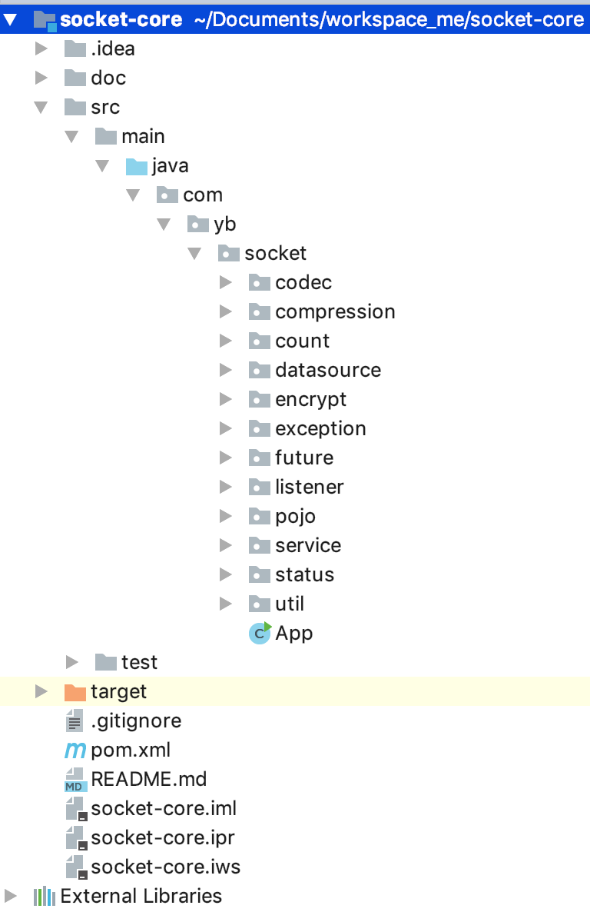

# socket-core: Netty4.x + MQTT

这是一个基于[Netty4.x](https://netty.io/) + [MQTT](http://mqtt.org/)实现的Push推送基础框架。相比于原生Netty，
socket-core会帮助上层服务做一下工作：

* 为C/S模式开发封装简单统一的编程模式
* 简单高性能的代码
* 统一的连接管理方案
* 统一的线程管理方案
* 网络基础问题的解决与支持：如心跳保持、压缩解压缩、编码与解码、加密与解密等
* 各种网络参数、连接池实现、监听器实现等可配置可替换
* 可实现对等集群
* 提供数据统计/监控组件
* 支持普通socket、MQTT、MQTT web socket协议

# 项目结构



* codec: 封装编码与解码
* compression: 封装压缩与解压缩
* count: 封装统计信息
* database: 基于hsql的内存数据库
* encrypt: 封装加密与解密
* future: 封装同步和异步调用
* listener: 封装事件监听，包括消息、通道、异常三类事件监听器
* service: 封装C/S模型、通道、心跳管理、消息分发等核心模块

# 压测报告

单Broker8核16G，支持44万连接(关掉心跳，感觉可以支撑更多)；1万客户端 单消息1024B 下行tps: 16万+；
4000客户端 Publish 单消息1024B 上行tps: 17万+，千兆网卡流量基本打满。
备注：Mqtt Server启动内存只分配了5G，如果分配到10G，理论上可以支持百万连接。还有，测试开启了心跳上报。

[查看连接数(telnet serverIp 8001; get status)](doc/status.png)

[查看连接数(ss -l)](doc/ss.png)

[1万客户端订阅推送性能](doc/sub.png)

[对应负载](doc/dstat_sub.png)

[4000客户端消息上行性能](doc/pub.png)

[对应负载](doc/dstat_pub.png)

# 使用说明

各测试类的源码在src/test/java/com/mgtv/socket包路径下: 
包括:
* 普通socket Server/Client
* MQTT socket Server/Client
* 带注册中心的普通socket/MQTT socket
* 基于内存数据库的模拟订阅推送

**Server**
```$xslt
Server server = new Server();
server.setPort(8000);
server.setOpenCount(true);
server.setCheckHeartbeat(true);
server.setOpenStatus(true);
server.addEventListener(new EchoMessageEventListener());
server.setSocketType(SocketType.MQTT);
server.bind();

//模拟推送
JSONObject message = new JSONObject();
message.put("action", "echo");
message.put("message", "this is mgtv push message!");

MqttRequest mqttRequest = new MqttRequest((message.toString().getBytes()));
while (true) {
    if (server.getChannels().size() > 0) {
        logger.info("模拟推送消息");
        for (WrappedChannel channel : server.getChannels().values()) {
            server.send(channel, "mgtv/notice/", mqttRequest);
        }
    }
    Thread.sleep(1000L);
}
```

**Client**
```$xslt
final String broker = "tcp://127.0.0.1:8000";
final String clientId = "GID_XXX@@@ClientID_123";
final String topic = "mgtv/notice/";
MemoryPersistence persistence = new MemoryPersistence();
try {
    final MqttClient sampleClient = new MqttClient(broker, clientId, persistence);
    final MqttConnectOptions connOpts = new MqttConnectOptions();
    logger.info("Connecting to broker: {}", broker);
    connOpts.setServerURIs(new String[]{broker});
    connOpts.setUserName("admin");
    connOpts.setPassword("123456".toCharArray());
    connOpts.setCleanSession(true);
    connOpts.setKeepAliveInterval(90);
    connOpts.setAutomaticReconnect(true);
    connOpts.setMqttVersion(MqttConnectOptions.MQTT_VERSION_3_1);
    sampleClient.setCallback(new MqttCallbackExtended() {
        public void connectComplete(boolean reconnect, String serverURI) {
            logger.info("connect success");
            //连接成功，需要上传客户端所有的订阅关系

            try {
                sampleClient.subscribe(topic,0);
            } catch (Exception ex) {
                ex.printStackTrace();
            }
        }

        public void connectionLost(Throwable throwable) {
            logger.error("server connection lost.", throwable);
        }

        public void messageArrived(String topic, MqttMessage mqttMessage) throws Exception {
            logger.info("message arrived. topic={}, message={}.", topic, new String(mqttMessage.getPayload()));
        }

        public void deliveryComplete(IMqttDeliveryToken iMqttDeliveryToken) {
            logger.info("delivery complete. messageId={}.", iMqttDeliveryToken.getMessageId());
        }
    });
    sampleClient.connect(connOpts);
    for (int i = 0; i < 3; i++) {
        try {
            String content = "hello world!" + i;
            //此处消息体只需要传入 byte 数组即可，对于其他类型的消息，请自行完成二进制数据的转换
            final MqttMessage message = new MqttMessage(content.getBytes());
            message.setQos(0);
            logger.info("public message '{}'", content);
            /**
             *消息发送到某个主题 Topic，所有订阅这个 Topic 的设备都能收到这个消息。
             * 遵循 MQTT 的发布订阅规范，Topic 也可以是多级 Topic。此处设置了发送到二级 Topic
             */
            sampleClient.publish(topic, message);
        } catch (Exception ex) {
            ex.printStackTrace();
        }
    }
} catch (Exception me) {
    me.printStackTrace();
}
```

# 压测工具

* https://github.com/daoshenzzg/mqtt-mock

# 参考项目

* https://github.com/netty/netty
* https://github.com/singgel/mqtt_iot_push
* https://github.com/Wizzercn/MqttWk

# 特别鸣谢

特别感谢我在[酷云互动](https://www.kuyun.com/web/)的前任领导**曾诗春**。是我职业生涯当中的偶像，此框架的原版也是由
他研发的基于netty3.x的封装升级而来。


