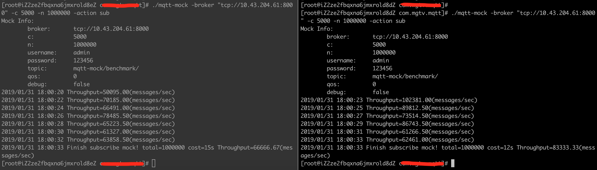
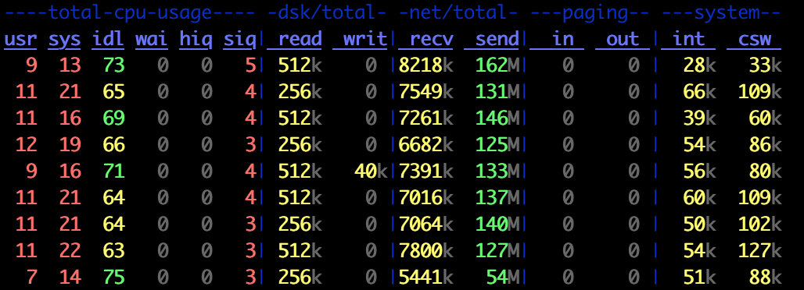
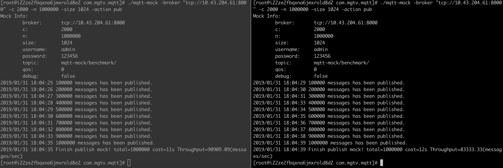
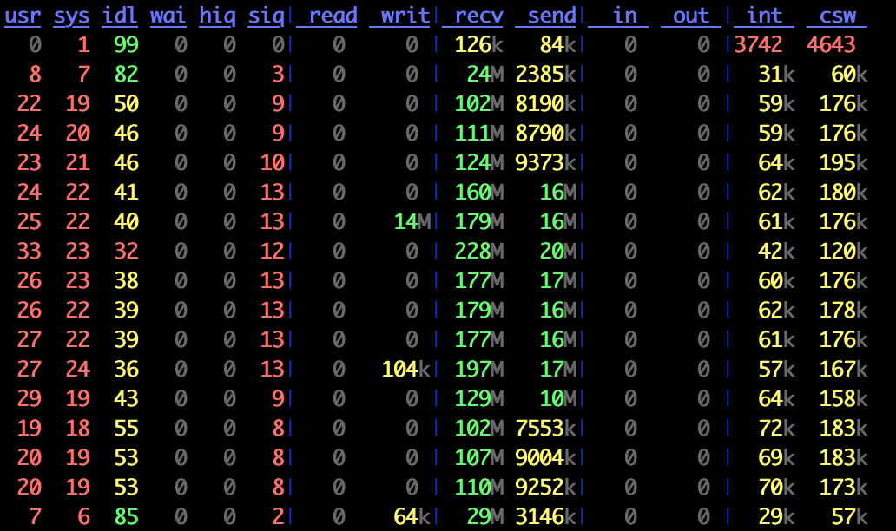
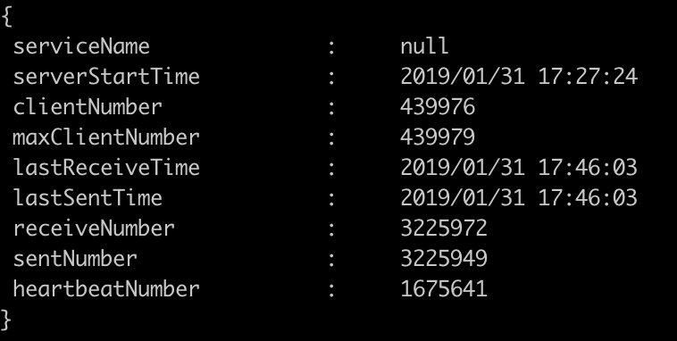
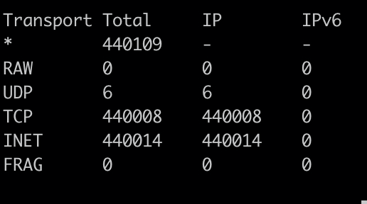

<a href="https://996.icu"></a>

# socket-mqtt: Netty4.x + MQTT

这是一个基于[Netty4.x](https://netty.io/) + [MQTT](http://mqtt.org/)实现的Push推送基础框架。相比于原生Netty，  
socket-mqtt：

- 为C/S模式开发封装简单统一的编程模式
- 简单高性能的代码
- 统一的连接管理方案
- 统一的线程管理方案
- 网络基础问题的解决与支持：如心跳保持、压缩解压缩、编码与解码、加密与解密等
- 各种网络参数、连接池实现、监听器实现等可配置可替换
- 可实现对等集群（见[负载均衡方案](LOAD_BALANCE.md)）
- 提供数据统计/监控组件
- 支持普通socket、MQTT、MQTT web socket协议及[自定义协议](src/main/java/com/yb/socket/pojo/protocol/README.md)

# 项目结构

- codec: 封装编码与解码
- compression: 封装压缩与解压缩
- count: 封装统计信息
- database: 基于hsql的内存数据库
- encrypt: 封装加密与解密
- future: 封装同步和异步调用
- listener: 封装事件监听，包括消息、通道、异常三类事件监听器
- service: 封装C/S模型、通道、心跳管理、消息分发等核心模块

# Linux内核参数配置

```
# 允许回收TCP连接  
net.ipv4.tcp_tw_reuse = 1  
net.ipv4.tcp_tw_recycle = 1  

# TCP 缓冲区内存  
net.ipv4.tcp_rmem = 4096 87380 8388608  
net.ipv4.tcp_wmem = 4096 87380 8388608  
net.ipv4.tcp_mem = 94500000 915000000 927000000    
# ulimits 优化  
fs.file-max = 1065353  
kernel.pid_max = 65536  
*  soft      nofile 655360  *  hard      nofile 655360  
```

# 压测报告

**MQTT协议-上下行消息处理能力压测**
> 单Broker8核16G，支持44万连接（进程启动内存5G、开启心跳）；1万客户端 单消息1024B 下行tps: 16万+； 4000客户端 Publish 单消息1024B 上行tps: 17万+，千兆网卡流量基本打满。

**自定义协议-单机连接数支撑能力压测**

> 单Broker8核16G开启心跳机制，客户端每30秒发送一次心跳，支持65万连接，稳定运行10分钟后，系统负载不到2个，服务端毫无压力。由于测试资源限制，理论上可以支持百万连接。


#### MQTT协议-消息下行能力

<table>  
    <tr>  
        <th>1万Clients订阅的消息下行能力</th>  
        <th>对应下行负载情况</th>  
    <tr>  
        <td width="50%">  
              
        </td>  
        <td width="50%">  
              
        </td>  
    </tr>  
</table>

#### MQTT协议-消息上行能力

<table>  
    <tr>  
        <th>4000Clients订阅消息上行能力</th>  
        <th>对应上行负载情况</th>  
    <tr>  
        <td width="50%">  
              
        </td>  
        <td width="50%">  
              
        </td>  
    </tr>  
</table>

#### MQTT协议-查看连接数情况

<table>  
    <tr>  
        <th>查看连接数(telnet 10.43.204.61 8001; get status)</th>  
        <th>查看连接数(ss -l)</th>  
    <tr>  
        <td width="50%">  
              
        </td>  
        <td width="50%">  
              
        </td>  
    </tr>  
</table>

# 使用说明

各种测试类的源码在src/test/java/com/yb/socket包路径下:  
包括:

- 普通socket Server/Client
- MQTT socket Server/Client
- 带注册中心的普通socket/MQTT socket
- 基于内存数据库的模拟订阅推送
- 自定义协议 Server/Client

## 服务启动配置选项

```java
Server server = new Server();  
// 设置Broker端口  
server.setPort(8000); // 设置启动信息统计。默认true  
server.setOpenCount(true);  
// 设置启用心跳功能。默认true  
server.setCheckHeartbeat(true);  
// 设置启动服务状态，默认端口8001。通过telnet server_ip 8001; get status查看服务信息  
server.setOpenStatus(true);  
// 服务状态端口。默认8001  
server.setStatusPort(8001);  
// 设置服务名称  
server.setServiceName("Demo");  
// 设置工作线程数量。默认CPU个数+1  
server.setWorkerCount(64);  
// 是否开户业务处理线程池。默认false  
server.setOpenExecutor(true);  
// 设置tcp no delay。默认true  
server.setTcpNoDelay(true);  
// 是否启用keepAlive。默认true  
server.setKeepAlive(true);  
// 自定义监听器，可处理相关事件  
server.addEventListener(new EchoMessageEventListener());  
// 设置Broker启动协议。SocketType.MQTT - MQTT协议； SocketType.NORMAL - 普通Socket协议；SocketType.MQTT_WS - MQTT web socket协议；  
server.setSocketType(SocketType.MQTT);  
// 绑定端口启动服务  
server.bind();  
```

## MQTT web socket server DEMO

```java
Server server = new Server();  
server.setPort(8000);  
server.addEventListener(new EchoMessageEventListener());  
server.setSocketType(SocketType.MQTT_WS);  
server.bind();  

//模拟推送  
String message = "this is a web socket message!";  
MqttRequest mqttRequest = new MqttRequest((message.getBytes()));  
while (true) {  
    if (server.getChannels().size() > 0) {        logger.info("模拟推送消息");        for (WrappedChannel channel : server.getChannels().values()) {            server.send(channel, "yb/notice/", mqttRequest);        }    }    Thread.sleep(1000L);}  
```

## MQTT web socket client(浏览器)

```
可用在线mqtt测试：http://www.tongxinmao.com/txm/webmqtt.php  
Topic  Payload    Time   QoS  
yb/notice/ this is a web socket message!  2019-2-27 16:54:54 0  
```

## Normal socket server DEMO

```java
Server server = new Server();  
server.setPort(8000);  
server.addEventListener(new JsonEchoMessageEventListener());  
server.addChannelHandler("decoder", JsonDecoder::new);  
server.addChannelHandler("encoder", JsonEncoder::new);  
server.bind();  

//模拟推送  
JSONObject message = new JSONObject();  
message.put("action", "echo");  
message.put("message", "this is a normal socket message!");  

Request request = new Request();  
request.setSequence(0);  
request.setMessage(message);  
while (true) {  
    if (server.getChannels().size() > 0) {        logger.info("模拟推送消息");        for (WrappedChannel channel : server.getChannels().values()) {            channel.send(request);            Thread.sleep(5000L);        }    }}  
```

## Normal socket client DEMO

```java
Client client = new Client();  
client.setIp("127.0.0.1");  
client.setPort(8000);  
client.setConnectTimeout(10000);  
client.addChannelHandler("decoder", JsonDecoder::new);  
client.addChannelHandler("encoder", JsonEncoder::new);  
client.connect();  

for (int i = 0; i < 2; i++) {  
    JSONObject message = new JSONObject();    message.put("action", "echo");    message.put("message", "hello world!");  
    Request request = new Request();    request.setSequence(i);    request.setMessage(message);    Response response = (Response) client.sendWithSync(request, 3000);  
    logger.info("成功接收到同步的返回: '{}'.", response);}  

client.shutdown();  
```

## 带注册中心 center DEMO

```java
Server server = new Server();  
server.setPort(9000);  
server.setCheckHeartbeat(false);  
server.addChannelHandler("decoder", JsonDecoder::new);  
server.addChannelHandler("encoder", JsonEncoder::new);  
server.addEventListener(new com.yb.socket.center.CenterMockMessageEventListener());  
server.bind();  
```

## 带注册中心 server DEMO

```java
Server server = new Server();  
server.setPort(8000);  
server.setCheckHeartbeat(false);  
server.setCenterAddr("127.0.0.1:9000,127.0.0.1:9010");  
server.addEventListener(new JsonEchoMessageEventListener());  
server.bind();  
```

## 带注册中心 client DEMO

```java
Client client = new Client();  
client.setCheckHeartbeat(false);  
client.setCenterAddr("127.0.0.1:9000,127.0.0.1:9010");  
client.addChannelHandler("decoder", JsonDecoder::new);  
client.addChannelHandler("encoder", JsonEncoder::new);  
client.connect();  

JSONObject message = new JSONObject();  
message.put("action", "echo");  
message.put("message", "hello");  

for (int i = 0; i < 5; i++) {  
    Request request = new Request();    request.setSequence(i);    request.setMessage(message);    client.send(request);    Thread.sleep(5000L);}  
```

# 后续规划

- 支持MQTT主题过滤机制
- 支持SSL连接方式
- 完整的QoS服务质量等级实现DEMO
- 遗嘱消息, 保留消息及消息分发重试

# 压测工具

- https://github.com/daoshenzzg/mqtt-mock

# 参考项目

- https://github.com/netty/netty
- https://github.com/1ssqq1lxr/iot_push
- https://github.com/Wizzercn/MqttWk
